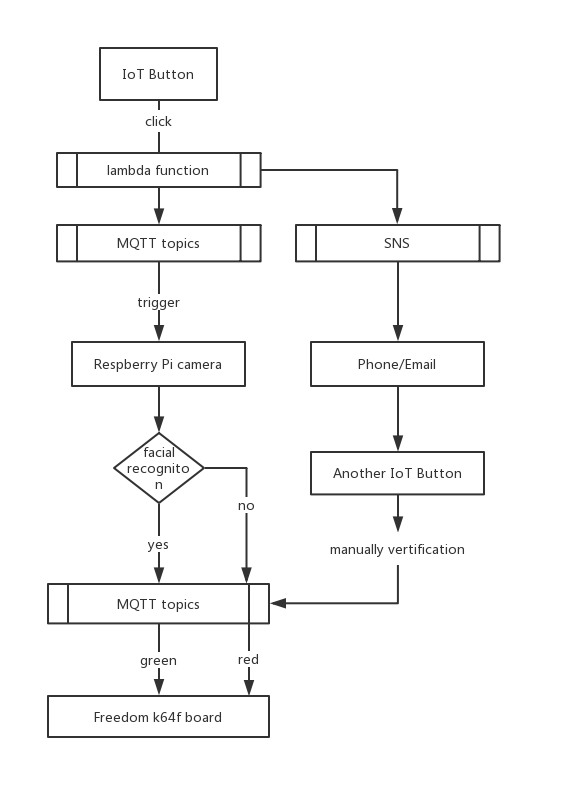

# SmartDoorbell

The goal of our project is to build a secure smart doorbell. There are several similar products like Dropcam, Nest Cam Indoor which are able to help you monitor house safety even when you are not at home. While these products are expensive and they may not have some of the function that we want. What if we want a smart doorbell which can recognize the person who is pressing the doorbell, and if this person has access in our database, door will open automatically. The user will receive a notification message and email at the same time. We are still working on realizing the function that the Pi will send the image to user’s phone and user can send a signal to open the door when recognition fails.

## Work flow

User presses button (knocking at the door) -> IoT button sends signal to AWS topic -> Pi receives signal from the topic -> trigger OpenCV facial recognition to detect and check whether this person has access -> If recognition succeeds, then sends signal to AWS topic -> freedom board gets signal from the topic -> turn on green light (open the door). Also, user can manually verify and approve the access by clicking another IoT button.

## Implementation
### IoT button
We are using AWS MQTT channel to intercommunicate with Pi. When the button is pressed, it will send string “RUN” to our topic (freertos/demos/echo) since we set up a lambda function to publish a message to the topic. For using IoT button, you need to download keys and certificate from AWS and configure them into your button. And In lambda function, you need to define your endpoint, the topic and the payload(message) you want to publish. Once you set up things above, you are able to send a message to the AWS topic.

### Raspberry Pi
Pi is expected to receive a message from the topic, thus you need to add new thing Pi in your AWS console. We are using AWSIoTPythonSDK to realize the function of receiving a signal and sending a signal from/to the topic that you subscribe and a Pi camera to capture the images.  Also, download the key and certificates, then set up your endpoint, certificate path, key paths, and the topic. The customCallback() function is to receive the message from the MQTT topic. If the message we get from the topic is “RUN” sent by the button, it will trigger OpenCV and recognize the person by the model we trained. If the visitor matches one of the people in our database, it will send a signal to myAWSIoTMQTTClient.publish() which will publish a message to MQTT topic. For example, “SINGLE” is the keyword in our demo.

### Freedom board K64F
For freedom board, we are using C SDK to receive a message from MQTT topic, which is the same topic channel as before(freertos/demos/echo). If the message freedom board gets equals to “SINGLE”  same as Pi published, it will turn green light on, which means the door opens.

## Files Description
01_face_dataset.py, 02_face_training.py, 03_face_recognition.py and haarcascade_frontalface_default.xml. 
These files can help you build up your own dataset and model. The model generated named trainer.yml should be placed in trainer folder. More details shown in FinalProjectReport. 

lambda.js is a nodejs file which should be set up in AWS IoT lambda function.

frdmk64f_aws_device_configuration_enet is a folder of configuration of freedom board.

FinalProjectDemo.mp4 and FinalProjectReport.docx show more details on the devices and codes.

## Run the code
Unzip frdmk64f_aws_device_configuration_enet.zip and REPLACE the origin files.

Python subscribe.py (before that, add the paths of your own certificate, key, RootCA... into line #15 to #22).

Press IoT button. 

If Picamera recognizes the person, the light of freedom board will turn green. Otherwise, it remains red.

### References
https://www.pyimagesearch.com/2017/09/04/raspbian-stretch-install-opencv-3-python-on-your-raspberry-pi/

https://zhuanlan.zhihu.com/p/46032511

https://shumeipai.nxez.com/2018/03/09/real-time-face-recognition-an-end-to-end-project-with-raspberry-pi.html#comment-58608

https://oldpan.me/ai-funny-news/face-detect-run-on-raspberry

https://www.jianshu.com/p/96be2417cc98

https://www.jianshu.com/p/2e65f641e4fc?utm_campaign=maleskine&utm_content=note&utm_medium=seo_notes&utm_source=recommendation

https://github.com/LiuXiaolong19920720/recognise-your-own-face

http://www.cirmall.com/bbs/thread-98337-1-1.html

https://medium.com/@julsimon/how-to-configure-an-aws-iot-button-7f43919afd97

https://www.jianshu.com/p/8cef6d1ed12b
